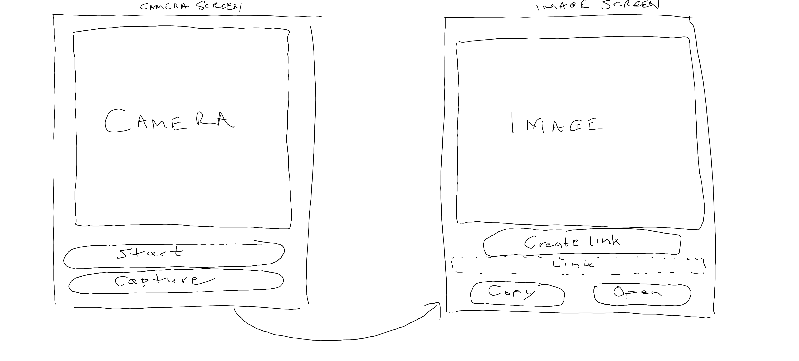

# Webcam Photo Sharer

## Description

An app that:

* Gets as input:
  * The output of the webcam.
  * Screen1: Button clicks to control the start/stop webcam and the capture snapshot actions.
  * Screen2: Button clicks to control the link creation, copy, and open actions.
* Returns:
  * An online image link of the webcam snapshot.

## Initial Design

### Front-End

### Classes, Attributes & Methods

* Webcam
  * Required attributes:
  * Methods: start(), stop(), capture()
* FileSharer
  * Required attributes: filepath, api
  * Methods: share()