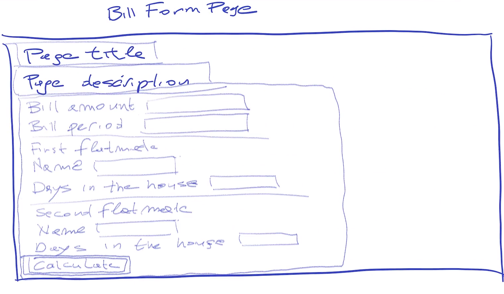

# Flatmates Bill WebApp

## Description

A web-app that:

* Gets as input (form):
  * The amount of a bill for a particular period
  * The days that each of the flatmates stayed in the house for that period
* Returns:
  * How much each flatmate has to pay
  * Generated PDF report stating the names of the flatmates, the period, and how much each of them had to pay.
  * Uploads it to FileStack and shares the link

## Initial Design

### Front-End

### Classes, Attributes & Methods

* HomePage
* BillFormPage
* ResultsPage
* BillForm
* Bill
  * Required attributes: amount, period
  * Methods: 
* Flatmate
  * Required attributes: name, days_in_house
  * Methods: pays(bill)
* PdfReport
  * Required attributes: filename
  * Methods: generate(flatmate1, flatmate2, bill)