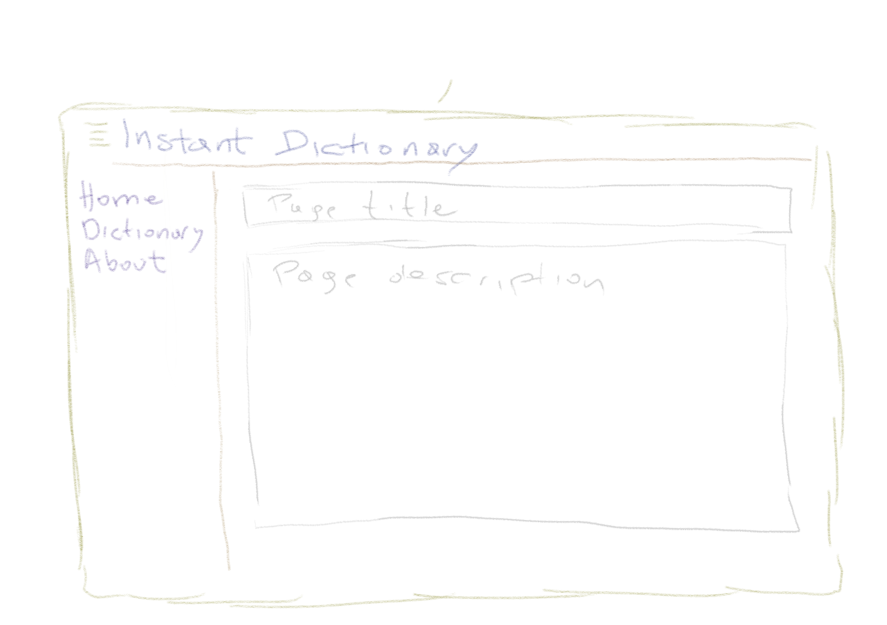
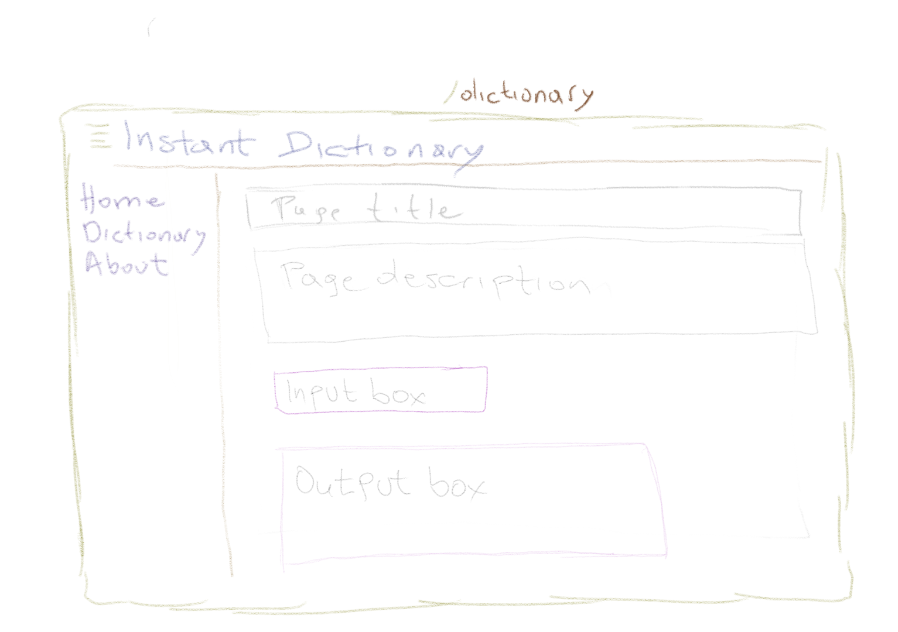
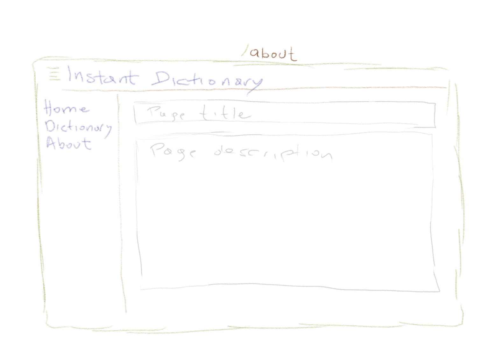

# Instant Dictionary Web App

## Description

A web app that:

* Gets as input (form):
  * Term
* Contains a navbar.
* Returns the English definition of that Term.

## Initial Design

### Front-End

### Classes, Attributes & Methods

* HomePage
* DictionaryPage
* AboutPage
* NavBar
* Definition
  * Required attributes: term
  * Methods: get()